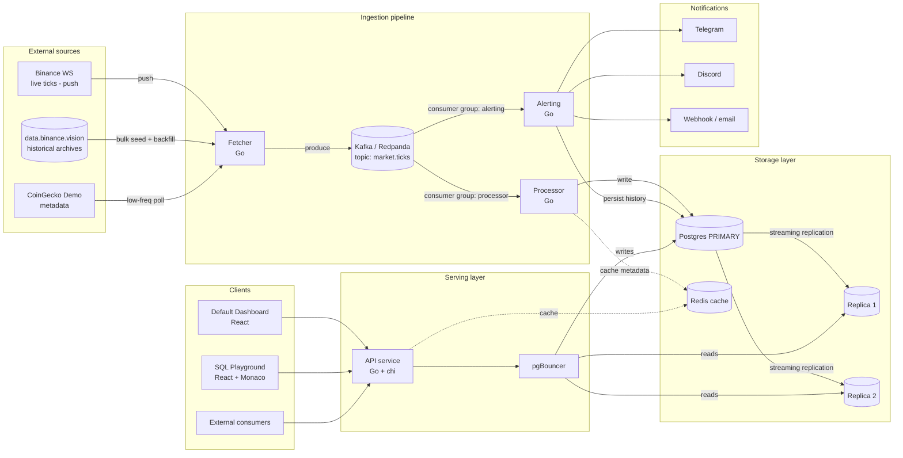

# Market Data Pipeline + SQL Playground — Technical Design

> **One-line pitch:** A self-hosted market-data platform where the database is a first-class citizen — run raw SQL against the full history, watch a live dashboard without writing a line, and configure price alerts, all on top of a distributed backend with streaming replication and end-to-end observability.

This document is the architectural source of truth for the project. Every component, every technology, and every schema decision below is deliberate. Where a choice was made between competing options, the rationale is documented inline — these are the decisions you should be able to defend in an interview.

---

## Table of contents

1. [Goals and non-goals](#1-goals-and-non-goals)
2. [Definitive technology stack](#2-definitive-technology-stack)
3. [System architecture](#3-system-architecture)
4. [Data model and schema](#4-data-model-and-schema)
5. [Service specifications](#5-service-specifications)
6. [API contract](#6-api-contract)
7. [SQL Playground design](#7-sql-playground-design)
8. [High availability and replication](#8-high-availability-and-replication)
9. [Observability](#9-observability)
10. [Repository structure](#10-repository-structure)
11. [Deployment](#11-deployment)
12. [CI/CD](#12-cicd)
13. [Execution roadmap by phase](#13-execution-roadmap-by-phase)
14. [Key design decisions (defendable rationale)](#14-key-design-decisions-defendable-rationale)

---

## 1. Goals and non-goals

### Goals

- **Showcase database engineering as a first-class skill.** Schema design, partitioning, justified indexing with `EXPLAIN ANALYZE`, materialized views, audit triggers, versioned migrations with tested rollback, streaming replication, and failover.
- **Demonstrate a decoupled, observable distributed backend.** Producers and consumers separated by an event log, multi-layer caching, services with single responsibilities.
- **Be reproducible by anyone in one command locally**, and deployable to Kubernetes via a Helm chart.
- **Tell a coherent story.** No technology is present "because it's trendy" — each one earns its place against a concrete requirement.

### Non-goals

- This is **not** a trading platform. No order execution, no financial advice, no real money. It ingests and serves public market data for analysis.
- **Not** a multi-tenant SaaS. Single-operator, self-hosted. Auth is minimal (a single operator token for write/admin endpoints); the read API and Playground are open by design for portfolio demonstration.
- **Not** chasing microservice maximalism. Four services exist because four responsibilities genuinely differ, not to inflate a diagram.

---

## 2. Definitive technology stack

| Layer | Choice | Version target |
|---|---|---|
| Backend services (Fetcher, Processor, Alerting, API) | **Go** | 1.23+ |
| Event streaming | **Kafka protocol**, via **Redpanda** locally | Redpanda latest stable / Kafka 3.x protocol |
| HTTP/API style | **REST** over `net/http` + **`chi`** router | chi v5 |
| Database access | **`pgx`** driver + **`sqlc`** code generation | pgx v5, sqlc latest |
| Schema migrations | **`golang-migrate`** (raw `.up.sql` / `.down.sql`) | latest |
| Cache / hot metadata | **Redis** | 7.x |
| Data sources | **Binance WebSocket** (live ticks/klines push) + **`data.binance.vision`** (bulk historical archives) + **CoinGecko Demo** (low-frequency metadata) | — |
| Charting | **Apache ECharts** (`echarts-for-react`) | echarts 5.x |
| Frontend | **React + TypeScript** + **monaco-editor** | React 18, TS 5.x |
| Database | **PostgreSQL** | 16+ |
| HA / clustering | **Patroni** + **etcd** | Patroni 3.x |
| Connection pooling / read-write split | **pgBouncer** | latest |
| Metrics | **Prometheus** + **postgres_exporter** | latest |
| Dashboards | **Grafana** (dashboards committed as JSON) | latest |
| Local orchestration | **Docker Compose** | Compose v2 |
| Kubernetes packaging | **Helm chart** | Helm 3 |
| CI/CD | **GitHub Actions** | — |

> **A note on language discipline:** the entire backend is Go. There is no JVM anywhere in the stack — that is why migrations use `golang-migrate` rather than Flyway/Liquibase, and why the broker is Redpanda (single binary, no Zookeeper, no JVM) rather than vanilla Kafka. The stack's thesis is *"native Go, no unnecessary layers,"* and every tooling choice respects it.

---

## 3. System architecture

### 3.1 High-level diagram



### 3.2 Data flow narrative

1. **Fetcher** maintains a persistent WebSocket to Binance for live trade/kline streams (data is *pushed* to it, not polled). It seeds deep history from `data.binance.vision` archives, backfills gaps via the Binance REST `klines` endpoint after any outage, and polls CoinGecko at low frequency only for slow-changing instrument metadata. It does *no* business logic — it normalizes each event into a canonical schema and produces it to the Kafka topic `market.ticks`, keyed by symbol so that all events for one symbol land on the same partition (preserving per-symbol ordering).

2. **Kafka (Redpanda)** is the durable event log. Two independent **consumer groups** read it:
   - `processor` — the write path into Postgres.
   - `alerting` — the rule-evaluation path.

   Because they are separate consumer groups, each one reads the full stream at its own pace; a slow alerting evaluation never blocks ingestion, and vice versa. This is the core decoupling of the system.

3. **Processor** consumes `market.ticks`, computes derived metrics (moving averages, rolling volatility, percentage change over windows), and writes to the partitioned `prices` table on the **primary**. It caches slow-changing instrument metadata in Redis to avoid re-querying on every tick.

4. **Alerting** consumes the same stream, evaluates user-configured rules (`price < X`, `change_pct > Y in Z minutes`, `crosses threshold`), persists fired-alert history to Postgres, and dispatches notifications (Telegram native, plus configurable webhook to Discord/email).

5. **API service** serves the frontend and external consumers over REST. It routes **writes to the primary and reads to the replicas** through pgBouncer, and caches hot read paths (last price, top movers) in Redis.

6. **Clients**: the default Dashboard and the SQL Playground both consume the same REST endpoints. The Playground additionally hits a dedicated, sandboxed query endpoint (see §7).

---

## 4. Data model and schema

### 4.1 Design principles

- **Time-series-first.** The dominant table (`prices`) is append-heavy and queried by time range. It is **range-partitioned by month** from day one.
- **Every index is justified.** No index exists without a documented `EXPLAIN ANALYZE` before/after in the repo. Indexing without measurement is cargo-culting; this project demonstrates the opposite.
- **Auditability.** Mutations to reference data are tracked by audit triggers (who/what/when).
- **Read models are materialized.** The default dashboard reads from materialized views, not from live aggregation over the raw partition set.

### 4.2 Core tables

#### `instruments` — reference data for tradable symbols

```sql
CREATE TABLE instruments (
    id            BIGINT      GENERATED ALWAYS AS IDENTITY PRIMARY KEY,
    symbol        TEXT        NOT NULL UNIQUE,         -- e.g. 'BTCUSDT'
    base_asset    TEXT        NOT NULL,                -- 'BTC'
    quote_asset   TEXT        NOT NULL,                -- 'USDT'
    source        TEXT        NOT NULL,                -- 'binance' | 'coingecko'
    is_active     BOOLEAN     NOT NULL DEFAULT TRUE,
    created_at    TIMESTAMPTZ NOT NULL DEFAULT now(),
    updated_at    TIMESTAMPTZ NOT NULL DEFAULT now()
);
```

> Note: identity columns (`GENERATED ALWAYS AS IDENTITY`) are the modern SQL-standard replacement for `serial` — prefer them in new schemas.

#### `prices` — the partitioned time-series fact table

```sql
CREATE TABLE prices (
    instrument_id BIGINT      NOT NULL REFERENCES instruments(id),
    ts            TIMESTAMPTZ NOT NULL,                -- event time (exchange timestamp)
    price         NUMERIC(20,8) NOT NULL,
    volume        NUMERIC(20,8),
    -- derived metrics, computed by Processor:
    ma_20         NUMERIC(20,8),                       -- 20-period moving average
    volatility    NUMERIC(20,8),                       -- rolling stddev
    ingested_at   TIMESTAMPTZ NOT NULL DEFAULT now()   -- pipeline arrival time
) PARTITION BY RANGE (ts);
```

Monthly partitions, e.g.:

```sql
CREATE TABLE prices_2026_06 PARTITION OF prices
    FOR VALUES FROM ('2026-06-01') TO ('2026-07-01');
```

> **Operational note:** partition creation is automated. Either schedule a job that pre-creates next month's partition, or adopt `pg_partman` for declarative partition lifecycle management. The README should document which approach is used and why — both are legitimate; `pg_partman` is the enterprise-standard answer and is worth a contribution PR per the roadmap.

The composite access pattern is "give me symbol X over time range T", so the primary index is:

```sql
CREATE INDEX idx_prices_instrument_ts ON prices (instrument_id, ts DESC);
```

`ts DESC` because the most common query is "latest N points," which a descending index serves without a sort. **This index must be presented in the README with its `EXPLAIN ANALYZE` justification** — that single artifact is more convincing to a DBA reviewer than any amount of prose.

#### `alert_rules` — user-configured alerting rules

```sql
CREATE TABLE alert_rules (
    id            BIGINT GENERATED ALWAYS AS IDENTITY PRIMARY KEY,
    instrument_id BIGINT      NOT NULL REFERENCES instruments(id),
    rule_type     TEXT        NOT NULL,                -- 'price_below' | 'price_above' | 'change_pct' | 'crosses'
    threshold     NUMERIC(20,8) NOT NULL,
    window_seconds INTEGER,                            -- for change_pct rules
    channel       TEXT        NOT NULL,                -- 'telegram' | 'discord' | 'webhook'
    target        TEXT        NOT NULL,                -- chat id / webhook url
    is_enabled    BOOLEAN     NOT NULL DEFAULT TRUE,
    created_at    TIMESTAMPTZ NOT NULL DEFAULT now()
);
```

#### `alert_history` — fired-alert audit log

```sql
CREATE TABLE alert_history (
    id            BIGINT GENERATED ALWAYS AS IDENTITY PRIMARY KEY,
    rule_id       BIGINT      NOT NULL REFERENCES alert_rules(id),
    fired_at      TIMESTAMPTZ NOT NULL DEFAULT now(),
    observed_value NUMERIC(20,8) NOT NULL,
    delivery_status TEXT       NOT NULL                -- 'sent' | 'failed' | 'retrying'
);
```

#### `saved_queries` — Playground shareable queries

```sql
CREATE TABLE saved_queries (
    id            UUID        PRIMARY KEY DEFAULT gen_random_uuid(),
    title         TEXT,
    sql_text      TEXT        NOT NULL,
    chart_config  JSONB,                               -- chart type, axes mapping
    created_at    TIMESTAMPTZ NOT NULL DEFAULT now()
);
```

UUID primary key so the share URL (`/q/{uuid}`) is non-enumerable.

### 4.3 Materialized views

For the default dashboard — e.g. an hourly OHLC roll-up:

```sql
CREATE MATERIALIZED VIEW mv_hourly_ohlc AS
SELECT
    instrument_id,
    date_trunc('hour', ts) AS bucket,
    (array_agg(price ORDER BY ts ASC))[1]  AS open,
    max(price)                              AS high,
    min(price)                              AS low,
    (array_agg(price ORDER BY ts DESC))[1] AS close,
    sum(volume)                             AS volume
FROM prices
GROUP BY instrument_id, date_trunc('hour', ts);

CREATE UNIQUE INDEX ON mv_hourly_ohlc (instrument_id, bucket);
```

The unique index enables `REFRESH MATERIALIZED VIEW CONCURRENTLY`, so dashboard reads are never blocked during refresh. **Refresh schedule must be documented** (e.g. every 5 minutes via a cron sidecar or `pg_cron`).

### 4.4 Audit triggers

Mutations to `instruments` and `alert_rules` are tracked:

```sql
CREATE TABLE audit_log (
    id          BIGINT GENERATED ALWAYS AS IDENTITY PRIMARY KEY,
    table_name  TEXT        NOT NULL,
    operation   TEXT        NOT NULL,                  -- 'INSERT' | 'UPDATE' | 'DELETE'
    row_id      TEXT        NOT NULL,
    old_data    JSONB,
    new_data    JSONB,
    changed_at  TIMESTAMPTZ NOT NULL DEFAULT now(),
    changed_by  TEXT                                    -- application-set session user
);
```

A generic trigger function captures `OLD`/`NEW` as JSONB and writes to `audit_log`. This demonstrates trigger authorship and the `current_setting('app.current_user', true)` pattern for propagating application identity into the database session.

---

## 5. Service specifications

All four services are Go binaries. They share a common internal library layout (`internal/`) for config loading, structured logging (`slog`), Prometheus instrumentation, and the `sqlc`-generated data-access layer.

### 5.1 Fetcher

The Fetcher is the ingestion boundary. Its central design decision is **push over poll**: live data arrives via a streaming WebSocket, not via REST polling. This is what makes the free data tiers a non-issue (see §14) and is itself a defensible engineering choice — Binance explicitly directs API users toward WebSocket streams for live updates to avoid rate-limit bans.

Three sources, each used in the mode it is built for:

| Source | What it provides | Mode | Why it doesn't hit free-tier limits |
|---|---|---|---|
| **Binance WebSocket** | Live ticks / klines | **Push** — one persistent connection, the exchange streams updates to us | A single connection can subscribe to up to 1024 streams; live data is pushed, not requested, so there is no per-request quota to exhaust. |
| **`data.binance.vision`** | Deep historical klines (years, per symbol/interval) | **Bulk file download** — fetched once, loaded with `COPY` | These are downloadable archive files, not an API — no rate limit applies. This is how the database is seeded with real history. |
| **Binance REST `klines`** | Gap backfill (what was missed while the Fetcher was down) | **Incremental pull**, up to 1000 bars per request | Sporadic, bounded use — only runs to fill detected gaps, nowhere near the weight limit. |
| **CoinGecko Demo** | Low-frequency metadata (instrument list, market cap, ranking, categories) | **Low-frequency REST poll** | Metadata changes slowly, so a handful of calls per hour against the 100/min · 10k/month Demo quota leaves enormous headroom; CoinGecko also doesn't charge a credit when a cached response is unchanged. |

- **Output:** all live events are normalized into the canonical schema and produced to Kafka topic `market.ticks`, keyed by `symbol` (so all events for one symbol land on the same partition, preserving per-symbol ordering).
- **Concerns:** WebSocket reconnection with exponential backoff, ping/pong keep-alive, deduplication, graceful handling of source outages, and **gap detection** — on reconnect, the Fetcher determines the time range it missed and triggers a REST backfill for it. Exposes `/metrics` (events produced, reconnects, backfill runs, source lag).
- **Why Go:** native concurrency makes the long-lived WS connection, the periodic metadata pollers, and the on-demand backfill workers clean to express with goroutines and channels.

> **Seeding the database (one-time historical load):** before the live pipeline is the steady state, the deep history comes from `data.binance.vision`. Download the per-symbol/per-interval archives, then bulk-load into the partitioned `prices` table with `COPY` (the fastest bulk-insert path in Postgres). Document this seed step in the README — it is how a fresh clone goes from empty to "queryable history" without ever touching a rate limit.

### 5.2 Processor

- **Input:** Kafka consumer group `processor`.
- **Output:** writes enriched rows to `prices` on the primary; updates instrument metadata cache in Redis.
- **Logic:** maintains rolling windows in-memory per symbol to compute `ma_20` and `volatility`; batches inserts using `pgx.CopyFrom` for throughput.
- **Concerns:** at-least-once consumption with idempotent writes; commits Kafka offsets only after successful DB write.

### 5.3 Alerting

- **Input:** Kafka consumer group `alerting`; rule definitions from `alert_rules` (cached, refreshed on change).
- **Output:** notifications (Telegram native API, configurable webhook → Discord/email); persists to `alert_history`.
- **Logic:** evaluates each tick against enabled rules; for windowed rules, maintains the necessary rolling state.
- **Reuse:** the Telegram integration pattern comes directly from your `vaultwatch` project.

### 5.4 API

- **Framework:** `net/http` + `chi`.
- **Responsibilities:** REST endpoints for the frontend and external consumers; read/write routing via pgBouncer; aggressive Redis caching of hot reads; the sandboxed Playground query endpoint (§7).
- **Cross-cutting:** middleware for request logging, Prometheus metrics, panic recovery, CORS, and rate limiting on the Playground endpoint.

---

## 6. API contract

REST, JSON, versioned under `/api/v1`. Representative endpoints:

| Method | Path | Purpose | Read/Write | Cache |
|---|---|---|---|---|
| `GET` | `/api/v1/instruments` | List tracked instruments | Read | Redis, 60s |
| `GET` | `/api/v1/prices/{symbol}/latest` | Last price for a symbol | Read | Redis, 1s |
| `GET` | `/api/v1/prices/{symbol}?from=&to=&interval=` | Historical series | Read | Redis, 10s |
| `GET` | `/api/v1/ohlc/{symbol}?interval=1h` | OHLC from materialized view | Read | Redis, 30s |
| `GET` | `/api/v1/movers?window=24h` | Top gainers/losers | Read | Redis, 30s |
| `POST` | `/api/v1/playground/query` | Execute sandboxed read-only SQL | Read (replica) | none |
| `POST` | `/api/v1/playground/save` | Save a query, return share URL | Write | — |
| `GET` | `/api/v1/playground/q/{uuid}` | Load a saved query | Read | — |
| `GET` | `/api/v1/alerts` | List alert rules | Read | — |
| `POST` | `/api/v1/alerts` | Create alert rule | Write | — |
| `DELETE` | `/api/v1/alerts/{id}` | Delete alert rule | Write | — |
| `GET` | `/healthz` / `/readyz` | Liveness / readiness | — | — |
| `GET` | `/metrics` | Prometheus scrape | — | — |

Write endpoints require an operator bearer token (`Authorization: Bearer <token>`). Read endpoints and the Playground are open by design.

---

## 7. SQL Playground design

This is the visually most impactful feature. **Record a short GIF/video and put it at the top of the README.**

### 7.1 Frontend

- **monaco-editor** for the SQL input (the same editor core as VS Code — syntax highlighting, autocompletion).
- On execute, the result renders with a **table ⇄ chart toggle**. Chart types via Apache ECharts: line, bar, and **candlestick** (the financial-data payoff).
- **Save query** persists to `saved_queries` and returns a shareable, non-enumerable URL (`/q/{uuid}`).

### 7.2 Backend sandbox — the security-critical part

The Playground executes **arbitrary user SQL**, so it must be sandboxed rigorously. This is itself a portfolio talking point about defensive database engineering. The endpoint enforces, in layers:

1. **Reads only ever hit a replica**, never the primary — a runaway query cannot affect the write path.
2. **A dedicated, least-privilege Postgres role** (`playground_readonly`) with `SELECT`-only grants on a whitelist of tables/views, `CONNECT` on the database, and nothing else. No DDL, no DML, no access to `alert_rules.target` (which holds webhook URLs / chat IDs) — that column is excluded from the role's grants or served via a sanitized view.
3. **Statement timeout** set per-session (`SET LOCAL statement_timeout = '5s'`).
4. **Row cap** via enforced `LIMIT` wrapping / `FETCH FIRST n ROWS ONLY`, plus a hard cap on result bytes streamed back.
5. **Read-only transaction** (`BEGIN READ ONLY`) as defense in depth.
6. **Rate limiting** on the endpoint (per IP) to prevent abuse.

> The combination of *replica-only + least-privilege role + statement timeout + read-only txn + row cap* is the kind of layered control a real DBA designs. Document it explicitly in the README — it signals security-conscious database thinking, not just feature-building.

---

## 8. High availability and replication

### 8.1 Topology

- **One primary + two replicas**, managed by **Patroni** with **etcd** as the distributed consensus store for leader election.
- **Streaming replication** (asynchronous by default; the README should note the sync-vs-async tradeoff and how to switch).
- **pgBouncer** in front, in transaction-pooling mode, providing the connection layer through which the API splits reads and writes.

### 8.2 Read/write split

The API service routes:
- **Writes** → primary (through pgBouncer).
- **Reads** → replicas (load-balanced), with the Playground specifically pinned to replicas.

### 8.3 Failover demonstration

A dedicated README section — **"How to simulate a failover"** — with step-by-step commands: kill the primary container, watch Patroni promote a replica via etcd, observe the API recover. This is the single most SRE-credible artifact in the project: it proves you understand not just that replication exists, but how leader election and promotion actually behave under failure.

---

## 9. Observability

### 9.1 Stack

**Prometheus** scrapes metrics from every service's `/metrics` plus **postgres_exporter**; **Grafana** visualizes. All dashboards are committed to the repo as JSON under `observability/dashboards/` so the setup is reproducible, not click-configured.

### 9.2 Panels to ship

- **Database:** cache hit ratio, lock waits, replication lag (primary→each replica), table/index bloat, transaction rate, longest-running queries.
- **Query latency:** p50 / p95 / p99 on the API read paths.
- **Pipeline:** Kafka consumer lag per consumer group, Fetcher events/sec, Processor write throughput, Processor batch sizes.
- **Cache:** Redis hit/miss ratio, eviction rate.
- **Alerting:** rules evaluated/sec, alerts fired, delivery success/failure.

### 9.3 pg_stat_statements

Enable `pg_stat_statements` in the Postgres config from day one. It is, per the roadmap, *the* number-one DBA tool. Use its output to drive every indexing decision in the README — read the top-10 slowest queries and let the data justify each index you add. This closes the loop between the observability story and the indexing story.

---

## 10. Repository structure

A Go monorepo with clearly separated services and shared internal packages:

```
market-data-pipeline/
├── README.md                     # the showcase: pitch, GIFs, architecture, "what I learned"
├── TECHNICAL_DESIGN.md           # this document
├── docker-compose.yml            # full local stack, one command
├── Makefile                      # make up / make migrate / make test / make lint
├── .github/
│   └── workflows/
│       ├── ci.yml                # test + lint + build images on every PR
│       └── release.yml           # tag → build & push versioned images
│
├── cmd/                          # one main package per binary
│   ├── fetcher/
│   ├── processor/
│   ├── alerting/
│   └── api/
│
├── internal/                     # shared, non-exported application code
│   ├── config/                   # env/config loading
│   ├── kafka/                    # producer/consumer wrappers
│   ├── db/
│   │   ├── sqlc/                 # sqlc-generated type-safe code (do not edit by hand)
│   │   └── queries/              # hand-written .sql consumed by sqlc
│   ├── metrics/                  # Prometheus helpers
│   ├── notify/                   # telegram / discord / webhook senders
│   └── domain/                   # core types
│
├── migrations/                   # golang-migrate: NNNN_name.up.sql / .down.sql
│
├── sqlc.yaml                     # sqlc configuration
│
├── web/                          # React + TypeScript frontend
│   ├── src/
│   │   ├── playground/           # monaco editor + ECharts result panel
│   │   ├── dashboard/            # default dashboard
│   │   └── api/                  # typed API client
│   └── package.json
│
├── observability/
│   ├── prometheus/
│   │   └── prometheus.yml
│   ├── dashboards/               # Grafana dashboards as JSON
│   └── alerts/                   # alerting rules, documented
│
├── deploy/
│   └── helm/                     # Helm chart: StatefulSets, PVCs, Services, ConfigMaps
│
├── patroni/                      # Patroni + etcd config for the HA topology
│
└── docs/
    ├── architecture.md           # the Mermaid/Excalidraw diagram source
    ├── failover.md               # "how to simulate a failover"
    └── benchmarks/               # EXPLAIN ANALYZE before/after each index
```

---

## 11. Deployment

### 11.1 Local — Docker Compose (primary path)

`docker compose up` brings up the **entire** stack: Postgres (primary + replicas + Patroni + etcd), Redpanda, Redis, the four Go services, pgBouncer, Prometheus, Grafana, and the frontend. This is the path a reviewer will actually run, so it must work end-to-end from a clean clone. The README's "run it locally" section is non-negotiable.

### 11.2 Kubernetes — Helm chart (the SRE payoff)

A Helm chart under `deploy/helm/` packages the application for Kubernetes:

- **StatefulSets** for Postgres (with the Patroni operator pattern) and Redpanda, each with **PersistentVolumeClaims**.
- **Deployments** for the stateless Go services and the frontend.
- **Services / ConfigMaps / Secrets** parameterized through `values.yaml`.

> **Why Helm and not Pulumi here:** they operate at different layers and don't compete. Pulumi is infrastructure-as-code — it *provisions* a cluster, VPC, nodes (it competes with Terraform). Helm is a *Kubernetes package manager* — it *deploys your app into* a cluster. For a database-focused portfolio, packaging a **stateful, replicated Postgres** into Kubernetes via Helm is the higher-signal artifact: it demonstrates orchestrating StatefulSets, PVCs, and a Postgres operator — exactly the hard part of running databases on K8s. Pulumi-provisioning a VPC says less about *database* engineering specifically. Pulumi is noted as a possible future add-on, not a priority.

---

## 12. CI/CD

GitHub Actions, with `main` always green:

- **On every PR (`ci.yml`):**
  - `go vet` + `golangci-lint`
  - `go test ./...` (unit + integration tests against an ephemeral Postgres service container)
  - **Migration round-trip test:** apply all `up` migrations, then all `down` migrations, asserting the schema returns cleanly — this proves rollback works, which the roadmap demands from day one.
  - Build all four service images.
  - Frontend: `tsc --noEmit`, lint, build.
- **On tag (`release.yml`):** build and push versioned images; attach a changelog. Releases are milestones (`v0.1.0`, `v0.2.0`, …).

### Operating discipline (per roadmap)

- Clean, narrative commit history — no massive force-pushes; the log tells the story of how the project grew.
- Open issues used as a public roadmap.
- Releases with changelogs as presentable milestones.

---

## 13. Execution roadmap by phase

Each phase is independently demonstrable. "Done" criteria are explicit so you always have a shippable checkpoint.

### Phase 0 — Skeleton (week 1–2)
- Repo initialized; README with the full vision and an architecture diagram (Mermaid or Excalidraw).
- `docker-compose.yml` with Postgres + Redis + Redpanda + a minimal Fetcher.
- Initial schema as the first `golang-migrate` migration (`instruments`, `prices` partitioned, with the down migration).
- **Done when:** `docker compose up` starts, the Fetcher connects to Binance and produces to Redpanda, and migrations apply and roll back cleanly.

### Phase 1 — Pipeline working end-to-end (week 3–4)
- Fetcher → Kafka → Processor → Postgres fully wired.
- `prices` partitioned by month, with the justified `(instrument_id, ts DESC)` index.
- **Historical seed**: a one-time loader that pulls archives from `data.binance.vision` and bulk-loads them into `prices` with `COPY`, so the database has real multi-year history (not just whatever accumulated since you started the Fetcher). This is also what makes the `EXPLAIN ANALYZE` benchmarks meaningful — index decisions only matter against a table with real volume.
- API with `last price` and `historical series` endpoints.
- **Done when:** the README contains `EXPLAIN ANALYZE` of the main query before and after the index (run against the seeded historical volume), and a live price flows from Binance into a queryable API response.

### Phase 2 — SQL Playground (week 5–6)
- React + TypeScript frontend with monaco-editor.
- Sandboxed `/playground/query` endpoint: replica-only, `playground_readonly` role, statement timeout, row cap, read-only txn, rate limit.
- Table ⇄ chart toggle (ECharts: line / bar / candlestick).
- Save query + shareable URL.
- **Done when:** a GIF of the Playground is in the README and a shared-query URL round-trips.

### Phase 3 — Alerting (week 7)
- Independent Alerting service on its own consumer group.
- Configurable rules via API (`price_below`, `price_above`, `change_pct`, `crosses`).
- Telegram native + configurable webhook; history persisted.
- **Done when:** a configured rule fires on live data and delivers a Telegram message, with the event recorded in `alert_history`.

### Phase 4 — Observability (week 8)
- postgres_exporter added to compose; Prometheus scraping all services.
- Grafana dashboards committed as JSON.
- Panels: cache hit ratio, lock waits, replication lag, bloat, query latency p50/p95/p99, Kafka consumer lag.
- **Done when:** a fresh clone brings up Grafana with populated dashboards, no manual configuration.

### Phase 5 — Replication + failover (week 9–10)
- Move from single Postgres to primary + 2 replicas via Patroni + etcd.
- API read/write split through pgBouncer.
- **Done when:** `docs/failover.md` walks through simulating a failover and the API demonstrably recovers after the primary is killed.

### Phase 6 — Polish (week 11–12)
- Audit triggers on reference tables.
- Materialized views for the dashboard with a documented refresh schedule.
- Final README: architecture diagram, justified design decisions, local-run instructions, Playground/Grafana GIFs, and a "What I learned" section.
- Helm chart finalized.
- **Done when:** the repo is `v1.0.0` — pinned, releasable, and reviewer-ready.

---

## 14. Key design decisions (defendable rationale)

This section exists so that every non-obvious choice has a one-paragraph answer ready for an interviewer.

**Go for all four services.** A single backend language keeps the project maintainable and is the de-facto standard for cloud-native infrastructure — the tooling your target companies (Timescale, Supabase, Grafana) build with. Goroutines make the Fetcher's long-lived WebSocket plus pollers clean, and Go compiles to small static binaries ideal for containers. Rust is reserved for the projects where it shines (`vaultwatch`, `mullvad-probe`); adding it here would add friction without a matching benefit for what is fundamentally a pipeline + CRUD workload.

**Kafka (via Redpanda), not Redis Streams.** Kafka is the industry standard for event streaming and gives true consumer groups — exactly what lets Processor and Alerting consume the same stream independently. It also speaks directly to target employers (Confluent). Redpanda provides the Kafka protocol in a single binary with no Zookeeper or JVM, so local operation stays light; the day this moves to the cloud, the client code points at a real Kafka cluster unchanged. This skips the throwaway intermediate step of Redis Streams.

**REST with `chi`, not Gin or GraphQL.** `chi` is a thin router built on top of the standard library's `net/http` rather than replacing it, so the code stays idiomatic Go — demonstrating platform mastery rather than framework dependence, which is what high-bar technical cultures value. GraphQL's resolver layer and N+1 pitfalls add complexity that distracts from the project's real focus (Postgres); the Playground is served perfectly by a few well-designed REST endpoints.

**`pgx` + `sqlc`, not an ORM.** This is the technical embodiment of the "ORM-skeptical" positioning. You write real, hand-tuned SQL — no ORM hiding the queries — yet `sqlc` generates type-safe Go from those queries, giving compile-time safety. It is the philosophical opposite of a GORM and speaks directly to the portfolio's narrative.

**`golang-migrate`, not Flyway/Liquibase.** Flyway/Liquibase are excellent but JVM-based, which would break the all-Go discipline by dragging Java into the container set. `golang-migrate` uses raw `.up.sql`/`.down.sql` you author by hand — reinforcing the "I control every `ALTER TABLE`" story — with tested rollback from day one, and integrates as a Go library or CLI in CI. Atlas (declarative) is more modern but hides migration SQL behind a desired-state diff; for a DBA portfolio the explicit, imperative control is the point. Atlas is a great blog-post topic, not the project's tool.

**Binance WebSocket + `data.binance.vision`, with CoinGecko relegated to metadata.** The free data tiers are *not* a constraint here — but only because the architecture uses each source the way it was designed to be used. Live data comes via Binance's WebSocket, where the exchange *pushes* updates over a single connection (one connection can carry up to 1024 symbol streams), so there is no per-request quota to exhaust — this is the model Binance itself recommends, displaying "use WebSocket Streams to avoid bans" when REST polling is abused. Deep history is seeded once from the free downloadable archives at `data.binance.vision` and bulk-loaded with `COPY`, so multi-year history never touches a rate limit. CoinGecko's heavily-limited free REST is therefore relegated to low-frequency metadata (instrument list, market cap, ranking) where its 100/min · 10k/month Demo quota is more than sufficient. This source-to-mode mapping is the single most important answer to "doesn't the free API limit you?" — the honest answer is no, because the design never polls for what should be streamed.

**Why this is a real product, not a rate-limited demo.** A serious market-data product consumes exactly these sources in exactly these modes: WebSocket for live, archive files for backtesting history, a metadata aggregator for reference data. The only differences between this self-hosted platform and a commercial data product are *coverage* (crypto via Binance rather than global equities with multi-provider redundancy) and *SLA* (no 99.99% guarantee to third parties) — not the fundamental data plumbing. The product itself — live ingestion, real history, arbitrary SQL, alerts — is genuinely functional and useful to anyone wanting to analyze crypto markets on their own terms.

**Apache ECharts, not Recharts or lightweight-charts.** The Playground is generic — arbitrary SQL yields time series, bar charts, or aggregation tables — *and* the data is financial, so candlestick matters. ECharts covers both in one library: high-quality native candlestick plus all standard chart types under one API. TradingView's lightweight-charts is superior for candlestick alone but too specialized for a generic Playground; Recharts is elegant but lacks native candlestick. ECharts is the optimal single dependency.

**Helm, not Pulumi (for now).** They aren't alternatives — Pulumi provisions infrastructure (it competes with Terraform), Helm packages an app for Kubernetes. For a database-centric portfolio, a Helm chart that orchestrates a *stateful, replicated Postgres* (StatefulSets, PVCs, a Postgres operator) is the higher-signal artifact, because running databases on Kubernetes is the genuinely hard SRE problem. Pulumi-provisioning a VPC demonstrates less about database engineering specifically, so it's noted as a future add-on rather than a priority.

---

*This document evolves with the project. Treat it as the contract; update it when a decision changes, and let the commit history of this file tell the story of the architecture maturing.*
